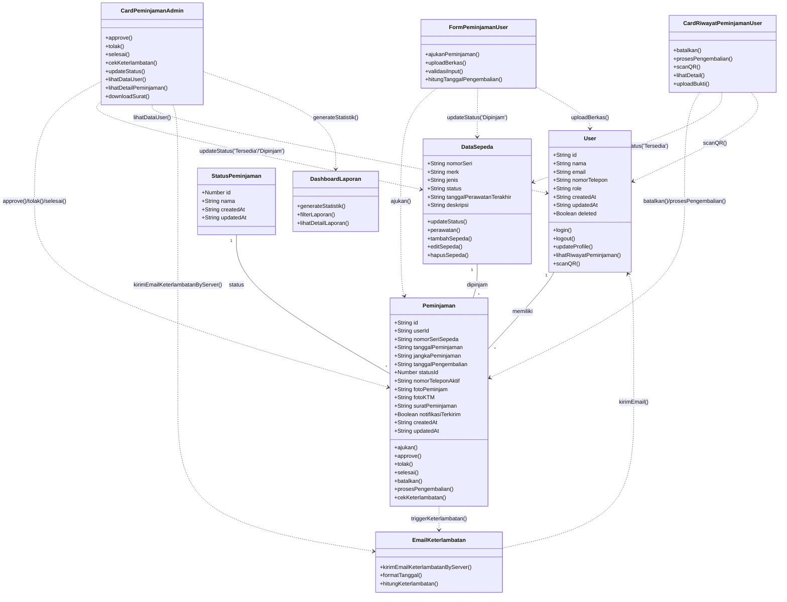

# 🚲 IPB Bike Center

https://github.com/raihanpka/ipb-bike-center/assets/88744379-314d-481e-90e0-948c4d124697

https://github.com/raihanpka/ipb-bike-center/assets/1375fabc-43e2-4ef8-b43c-594d40eef6fc

---

## 📌 Diagram



---

## ✨ Fitur Utama

- Layanan Peminjaman & Pengembalian Sepeda (✅)
- Autentikasi & Manajemen Akun Pengguna (✅)
- Dashboard Admin dan Pengguna (✅)
- Manajemen Data Sepeda bagi Admin (✅)
- Laporan Peminjaman & Generate Dokumen PDF bagi Admin (✅)
- Notifikasi Keterlambatan Pengembalian Sepeda via Email (✅)
- Fitur Tiket untuk Melaporkan Masalah pada Sepeda (🟡)

---

## 🛠️ Tech Stack

- **Framework**: [Next.js](https://nextjs.org/)
- **Database**: [Supabase](https://supabase.com)
- **Authentication**: [Clerk](https://clerk.com)
- **CSS Framework**: [TailwindCSS](https://tailwindcss.com/)
- **UI Library**: [shadcn/ui](https://ui.shadcn.com/)
- **Cloud Deployment**: [Vercel](https://vercel.com/)
- **Document Generation**: [jsPDF](https://www.npmjs.com/package/jspdf) & [jsPDF-autotable](https://www.npmjs.com/package/jspdf-autotable)
- **Email API**: [Resend](https://resend.com)

---

## 🚀 Getting Started

### 1. Clone repositori

```bash
git clone https://github.com/raihanpka/ipb-bike-center.git
cd ipb-bike-center
```

### 2. Install dependencies

```bash
pnpm install
# atau
npm install
```

### 3. Setup Environment Variables

Salin file `.env.local.example` menjadi `.env.local` lalu isi sesuai kebutuhan.

### 4. Jalankan server development

```bash
npm run dev
```

Aplikasi akan berjalan di [http://localhost:3000](http://localhost:3000)

---

## 💻 Pengembangan Lokal

1. Clone kode
2. Install dependencies
3. Setup environment variables
4. Jalankan `npm run dev`

---

## 🤝 Kontribusi

1. Fork repositori ini
2. Buat branch baru:
   ```bash
   git checkout -b feat/nama-fitur
   ```
3. Lakukan perubahan yang diinginkan
4. Commit & push:
   ```bash
   git commit -m "Add your feature"
   git push origin feat/nama-fitur
   ```
5. Ajukan Pull Request

---

## 📄 Lisensi

MIT License. Dibuat oleh Kelompok 1 - Paralel 2 ✌️

